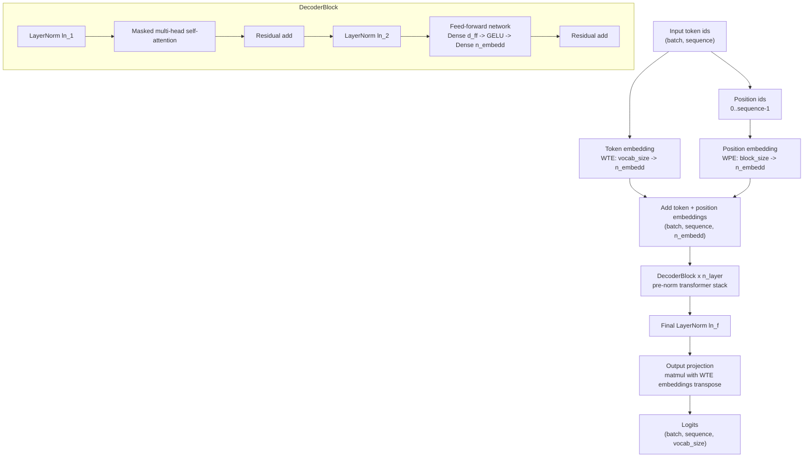
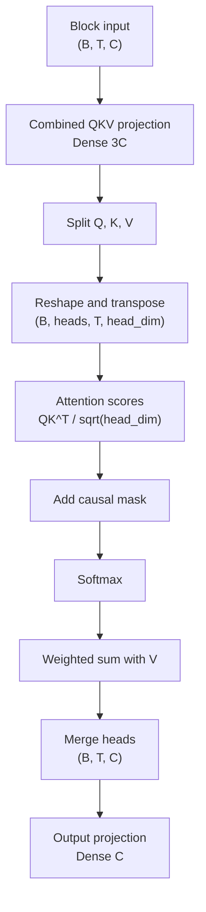

# GPT Model Flowchart

This diagram summarizes the TensorFlow GPT decoder implemented in `GPT/model/gpt.py`
and its supporting layers under `GPT/layers/`.

## Attention Detail

## Default Configuration Shape

| Component | Default |
| --- | --- |
| Vocabulary size | 50257 |
| Block size | 128 |
| Layers | 12 |
| Attention heads | 12 |
| Embedding width | 768 |
| Feed-forward width | 3072 |
